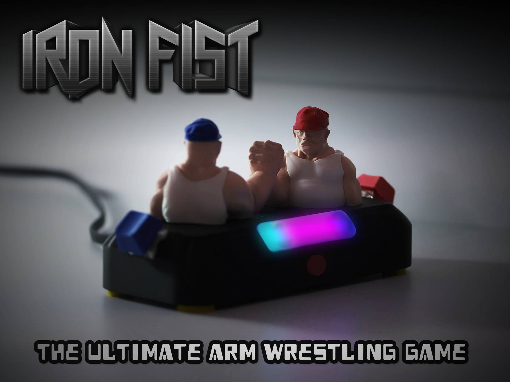
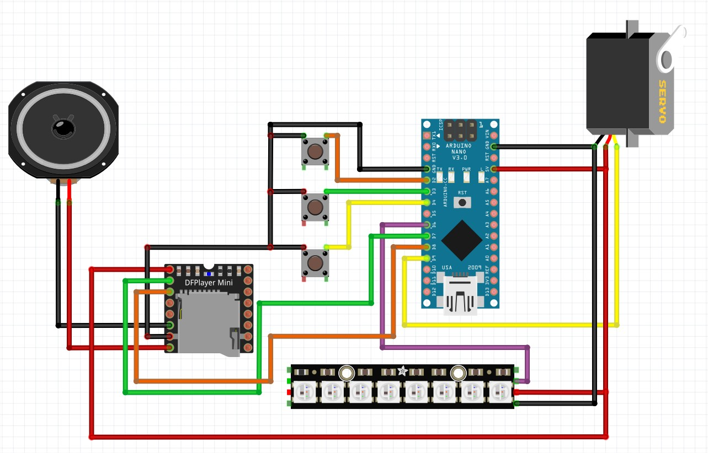

# Iron Fist Game

<div align="center">
  
</div>

A 3D-printed two-player Arduino game where players compete by rapidly pressing buttons to tilt connected arms in their favor.

## Overview

<div align="center">
  
  
</div>

Iron Fist is an interactive arm-wrestling game featuring two 3D-printed characters with joined arms controlled by a servo motor. Players must rapidly press their buttons to pull the arms to their side. The first player to reach the maximum position wins!

### Demo Video

[](https://www.youtube.com/watch?v=AkbmJ1xRAMI)

## Hardware Components

| Component | Model/Type | Purpose |
|-----------|------------|---------|
| **Arduino Nano** | Arduino Nano | Main controller |
| **Start Button** | Push Button | Start game |
| **Player Buttons** | 2x Cherry MX Switch | Player 1 & 2 controls |
| **Servo Motor** | SG90 | Controls the arm movement |
| **LED Strip** | NeoPixel (8 LEDs) | Visual feedback and animations |
| **MP3 Module** | DFPlayer Mini | Audio playback |
| **Speaker** | Speaker | Sound output |

## Features

### Visual Effects
- **12 Synchronized Idle Animations**: Rainbow, comet trail, breathing, fire, ocean wave, scanner, sparkle, running lights, color wipe, theater chase, pulse rainbow, and strobe party
- **Music-Synchronized Timing**: All animations sync to 105 BPM background music
- **Dynamic Score Visualization**: Real-time LED feedback showing game progress
- **Smooth Color Transitions**: Purple → Red/Blue based on player advantage

### Audio System
- **Global Volume Control**: Easy adjustment via `GLOBAL_VOLUME_MULTIPLIER`
- **Dynamic Volume**: Sound intensity increases as players approach victory
- **Multiple Sound Effects**: Idle music, start sound, gameplay cheering, victory fanfare

### Gameplay Mechanics
- **Responsive Controls**: No button debouncing on player buttons for maximum responsiveness
- **Smooth Servo Movement**: 2-degree steps with micro-vibrations for realistic effect
- **Balanced Scoring**: Score difference determines arm position
- **Victory Knockout**: Dramatic final animation sequence

## Pin Configuration



### Pin Connection Table

| Component | Arduino Pin | Component Pin | Power | Ground |
|-----------|-------------|---------------|-------|--------|
| **Start Button** | Pin 2 | Signal | - | GND |
| **Player 1 Button (Cherry MX)** | Pin 3 | Signal | - | GND |
| **Player 2 Button (Cherry MX)** | Pin 4 | Signal | - | GND |
| **SG90 Servo** | Pin 9 | Signal (Orange) | 5V (Red) | GND (Brown) |
| **NeoPixel Strip** | Pin 6 | Data In | 5V | GND |
| **DFPlayer Mini** | Pin 7 (RX) | TX | 5V | GND |
| **DFPlayer Mini** | Pin 8 (TX) | RX | - | - |
| **Speaker** | - | - | DFPlayer SPK+ | DFPlayer SPK- |

```cpp
#define BUTTON_START_PIN 2      // Start game button
#define BUTTON_PLAYER1_PIN 3    // Player 1 button (Red)
#define BUTTON_PLAYER2_PIN 4    // Player 2 button (Blue)
#define SERVO_PIN 9             // SG90 servo control
#define NEOPIXEL_PIN 6          // NeoPixel data line
#define DFPLAYER_RX 7           // DFPlayer receive
#define DFPLAYER_TX 8           // DFPlayer transmit
```

## Installation

1. **3D Printing**
   - Download the 3D files from Makerworld: https://makerworld.com/fr/models/1526232-flick-out-mini-arcade-punching-machine

2. **Software Setup**
   - Install required Arduino libraries:
     - Servo
     - Adafruit_NeoPixel
     - SoftwareSerial
     - DFRobotDFPlayerMini
   - Upload the provided code to Arduino Nano

3. **Audio Setup**
   - Format SD card as FAT32
   - ⚠️ Copy audio files to SD card root directory - copy files one by one, in order!
   - Place these files on the DFPlayer Mini's SD card:
     - **001.mp3** - Idle background music
     - **002.mp3** - Game start sound
     - **003.mp3** - Victory fanfare
     - **004.mp3** - Gameplay cheering loop
   - Insert SD card into DFPlayer Mini

## Configuration

### Volume Settings
Adjust the global volume multiplier in the code:
```cpp
#define GLOBAL_VOLUME_MULTIPLIER 0.7  // 0.1 (quiet) to 1.0 (full volume)
```

### Game Timing
```cpp
#define BPM 105                    // Music tempo
#define SERVO_STEP_SIZE 2          // Servo movement per score difference
#define GAME_UPDATE_INTERVAL 50    // Game update frequency (ms)
```

## Libraries Required

```cpp
#include <Servo.h>
#include <Adafruit_NeoPixel.h>
#include <SoftwareSerial.h>
#include <DFRobotDFPlayerMini.h>
```

## Credits

Music by penguinmusic - **Dynamic Sport Electro** from Pixabay

---

*Iron Fist Game - Where quick fingers meet epic battles!*